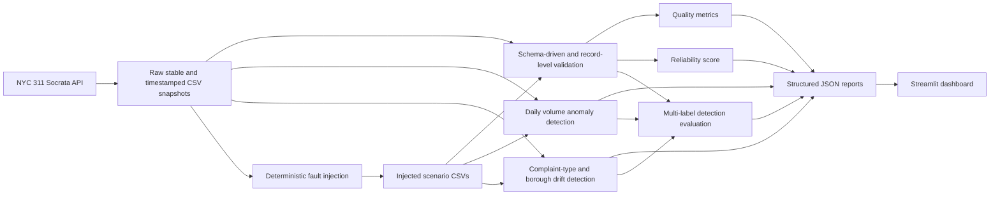

# CivicData Guardian

[](https://github.com/SamavartaX5/CivicDataGuardian/actions/workflows/ci.yml)

CivicData Guardian monitors the reliability of NYC 311 public data. It downloads a recent Socrata sample, validates its schema and records, measures data quality, detects daily-volume anomalies and categorical drift, injects controlled faults, evaluates detector performance, produces JSON incident reports, and displays the results in Streamlit.

## Why this matters

Public-data feeds can change quietly: a source may rename a column, emit malformed timestamps, shift category distributions, or stop populating a key field. Those changes can silently break dashboards, analytics, and downstream ML systems. CivicData Guardian makes those failures visible before consumers rely on bad data.

## Architecture



## Implemented features

- NYC 311 Socrata API ingestion with a stable latest CSV and timestamped snapshots.
- Extensible YAML data contract for the selected NYC 311 fields.
- Schema, datatype, required-column, and unexpected-column validation.
- Record-level checks for identifiers, timestamps, coordinates, categorical values, and date order.
- Missingness monitoring, exact duplicate-row metrics, and duplicate request-ID detection.
- Daily request-volume anomaly detection and complaint-category/borough distribution drift detection.
- Unseen complaint-category detection.
- Twelve deterministic fault-injection scenarios and multi-label precision/recall/F1 evaluation.
- Configurable reliability scoring and structured JSON reliability/evaluation reports.
- Streamlit dashboard with operational quality, anomaly/drift, and incident views.
- Offline pytest coverage, Docker support, and GitHub Actions CI.

## Repository structure

```text
CivicDataGuardian/
├── app/
│   └── streamlit_app.py       # Four-section monitoring dashboard
├── config/
│   └── schema.yaml            # NYC 311 data contract and thresholds
├── data/
│   ├── raw/                   # Downloaded CSV snapshots (ignored by Git)
│   ├── processed/             # Reserved processed-data location
│   └── injected/              # Generated fault scenarios (ignored by Git)
├── reports/                   # Generated JSON reports (ignored by Git)
├── src/
│   ├── ingestion.py           # Socrata download and snapshot writing
│   ├── validation.py          # Schema-driven validation engine
│   ├── quality_metrics.py     # Dataset-quality metric helpers
│   ├── anomaly_detection.py   # Daily-volume detection
│   ├── drift_detection.py     # Categorical distribution drift detection
│   ├── fault_injection.py     # Deterministic corrupted datasets
│   ├── reporting.py           # Reliability and incident reports
│   └── pipeline.py            # End-to-end orchestration and evaluation
├── tests/                     # Offline pytest suite
├── .github/workflows/ci.yml   # GitHub Actions CI
├── Dockerfile                 # Streamlit container image
├── requirements.txt
└── run_monitor.py             # Main project entry point
```

## Technology stack

- Python 3.13
- pandas and NumPy for tabular processing and deterministic sampling
- requests for Socrata API access
- PyYAML for the schema contract
- Streamlit for the dashboard
- pytest for automated tests
- Docker and GitHub Actions for reproducible local and CI execution

## Dataset

- **Source:** [NYC 311 Service Requests](https://data.cityofnewyork.us/resource/erm2-nwe9.json)
- **Socrata dataset ID:** `erm2-nwe9`
- **Initial sample:** 5,000 most-recent records, sorted by `created_date` descending
- **Selected fields:** `unique_key`, `created_date`, `closed_date`, `agency`, `complaint_type`, `descriptor`, `status`, `borough`, `incident_zip`, `latitude`, and `longitude`

## Installation and local setup

In Windows PowerShell:

```powershell
git clone https://github.com/SamavartaX5/CivicDataGuardian.git
cd CivicDataGuardian
py -3.13 -m venv .venv
.\.venv\Scripts\Activate.ps1
python -m pip install --upgrade pip
python -m pip install -r requirements.txt
```

## Running the project

Run the full monitoring and deterministic evaluation pipeline:

```powershell
python run_monitor.py
```

Run the dashboard after the pipeline has generated its artifacts:

```powershell
streamlit run app/streamlit_app.py
```

Useful focused entry points:

```powershell
python -m src.ingestion
python -m src.validation
python -m src.fault_injection
```

`run_monitor.py` writes both `reports/latest_report.json` and `reports/latest_evaluation.json`. When the dashboard starts without generated artifacts, it safely displays an instruction to run the monitoring pipeline; its sidebar button can generate them.

## Tests

```powershell
pytest -q
```

Current verified result: **27 passed**. The suite uses deterministic fixtures and mocked ingestion responses; normal test execution does not depend on the live NYC 311 API or pre-existing local datasets/reports.

## Docker

```powershell
docker build -t civicdata-guardian .
docker run --rm -p 8501:8501 civicdata-guardian
```

Open [http://localhost:8501](http://localhost:8501). In a fresh container, use **Run monitoring pipeline** in the sidebar to download data and generate the raw, injected, and report artifacts. They are intentionally excluded from the image build context and are created at runtime.

## GitHub Actions CI

On every push to `main` and pull request targeting `main`, CI uses Ubuntu and Python 3.13 to:

1. install dependencies with pip caching;
2. compile `src`, `app`, `tests`, and `run_monitor.py`;
3. run the complete offline pytest suite and the explicit pipeline smoke test; and
4. build the Docker image as `civicdata-guardian:ci`.

The workflow has read-only repository permissions, does not call the live API, and does not deploy or push images.

## Validation rules

The rules are loaded from [`config/schema.yaml`](config/schema.yaml), not duplicated in Python.

- **Schema checks:** required columns, unexpected columns, and semantic datatype compatibility.
- **Record checks:** missing/blank and duplicate `unique_key` values; invalid `created_date` or `closed_date`; `closed_date` earlier than `created_date`; non-numeric or out-of-range coordinates; and non-nullable categorical values.
- **Dataset checks:** missing-value percentage per column and configured thresholds, exact duplicate rows, duplicate request-ID metrics, invalid timestamp/coordinate row counts, invalid date-order counts, and rejected-row counts.
- **Configured examples:** `unique_key` and `created_date` are non-nullable; `incident_zip` remains a string; latitude/longitude ranges are -90 to 90 and -180 to 180 respectively.

## Fault-injection scenarios

| Scenario | Expected detector type(s) |
| --- | --- |
| Delete required `agency` column | `missing_required_column` |
| Rename `complaint_type` to `complaint_category` | `missing_required_column`, `unexpected_column` |
| Insert invalid latitude text | `invalid_numeric_value` |
| Append rows while preserving request IDs | `duplicate_unique_key` |
| Insert invalid `created_date` text | `invalid_timestamp` |
| Increase `descriptor` missingness by ~10 points | `missingness_threshold_exceeded` |
| Increase `descriptor` missingness by ~25 points | `missingness_threshold_exceeded` |
| Increase `descriptor` missingness by ~50 points | `missingness_threshold_exceeded` |
| Add a daily request-volume spike | `volume_anomaly` |
| Shift `complaint_type` frequencies | `category_drift` |
| Add an unseen complaint type | `unexpected_category` |
| Set `closed_date` before `created_date` | `invalid_date_order` |

## Actual measured results

The following values were read from the current `reports/latest_report.json` and `reports/latest_evaluation.json` artifacts (run timestamp: 2026-07-20 UTC).

| Metric | Current value |
| --- | ---: |
| Clean rows processed | 5,000 |
| Total rows evaluated | 65,600 |
| Peak scenario size | 5,500 |
| True positives | 13 |
| False positives | 0 |
| False negatives | 0 |
| True negatives | 117 |
| Precision | 1.0 |
| Recall | 1.0 |
| F1 score | 1.0 |
| False-positive rate | 0.0 |
| Reliability score | 100 / 100 |
| Health status | Healthy |
| Clean records validated per second | 2,685.256 |
| Evaluation records validated per second | 35,230.559847 |
| Verified pytest tests | 27 passed |

These detection metrics are measured against deterministic injected scenarios, not uncontrolled production incidents.

## Reliability score

The 0–100 reliability score starts at 100 and applies configurable penalties to aggregated validation issue objects. It is a product rule for this project—not a universal scientific score—and its weights should be calibrated for the operating context.

## Dashboard

The Streamlit app has four sections:

1. **Overview** — clean reliability, health status, pipeline throughput, and evaluation metrics.
2. **Data Quality** — schema/validation status, duplicate metrics, missingness, and rejected-row context.
3. **Anomalies and Drift** — scenario status, daily-volume comparisons, and complaint-type drift details.
4. **Incident Report** — clean and selected-scenario incidents plus JSON-report downloads.

To add screenshots later, capture the running dashboard at `http://localhost:8501` after running the pipeline and place documented image assets in the repository. No screenshot files are currently included.

## Limitations

- Covers one public dataset and a recent sample rather than long-term stored history.
- Rule thresholds need domain calibration as source behavior evolves.
- Fault-injection performance does not prove identical production performance.
- No alert-delivery system, persistent database, or historical monitoring store is implemented.
- Rolling volume detection has limited history in the initial recent-record sample.

## Future improvements

- Scheduled monitoring runs.
- A longer historical baseline for anomaly detection.
- Slack or email alert delivery.
- Persisted monitoring history and trend analysis.
- Additional civic datasets.
- Production threshold calibration with domain owners.

## Two-minute demo flow

1. Run `python run_monitor.py`.
2. Open the Streamlit dashboard.
3. Review the clean reliability score and quality metrics in **Overview** and **Data Quality**.
4. Select the volume-spike, category-shift, or unseen-category scenario in the sidebar.
5. Inspect detector findings in **Anomalies and Drift** and incident details in **Incident Report**.
6. Download the generated JSON reports if needed.

## Resume bullets

- Built a Python monitoring pipeline for NYC 311 data that validated 5,000 records and achieved 13/13 detected deterministic fault incidents with 1.00 precision, recall, and F1 and zero false positives in the current evaluation run.
- Delivered a Dockerized Streamlit observability dashboard with schema validation, volume/category drift detection, structured reliability reports, and a 27-test offline CI suite.
